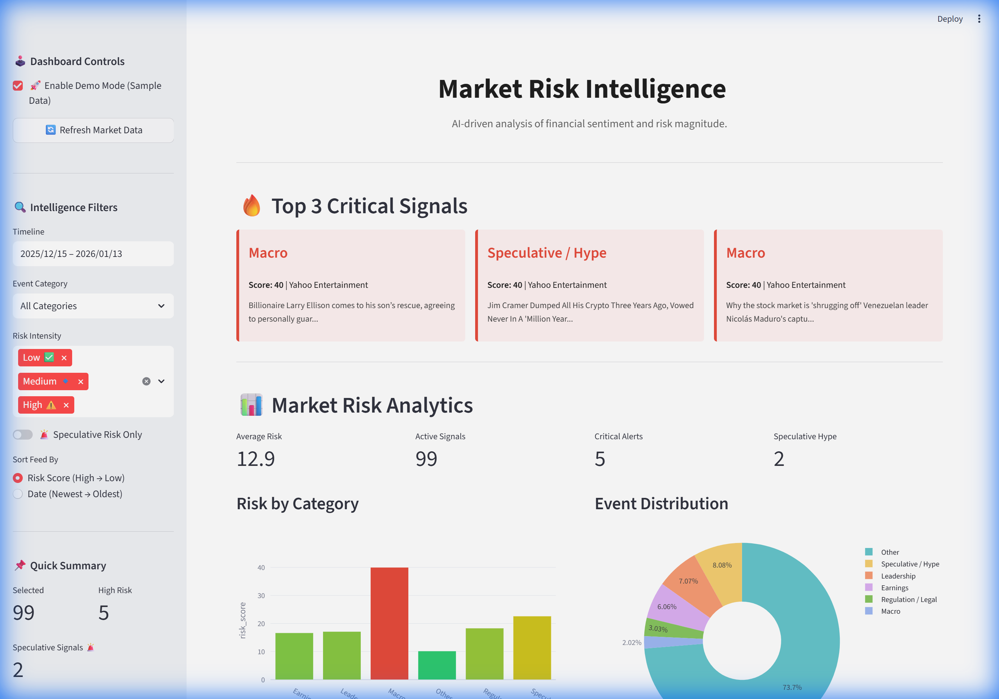
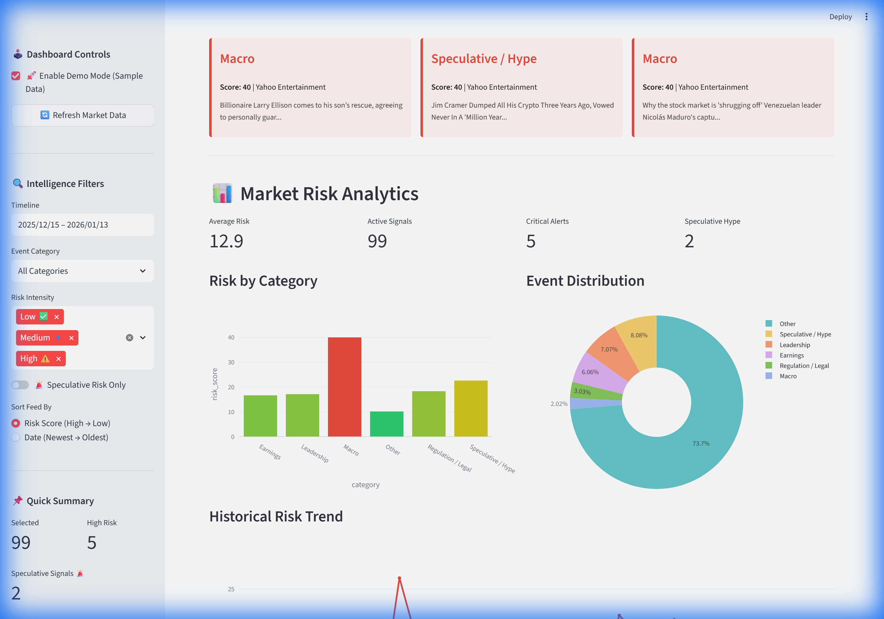
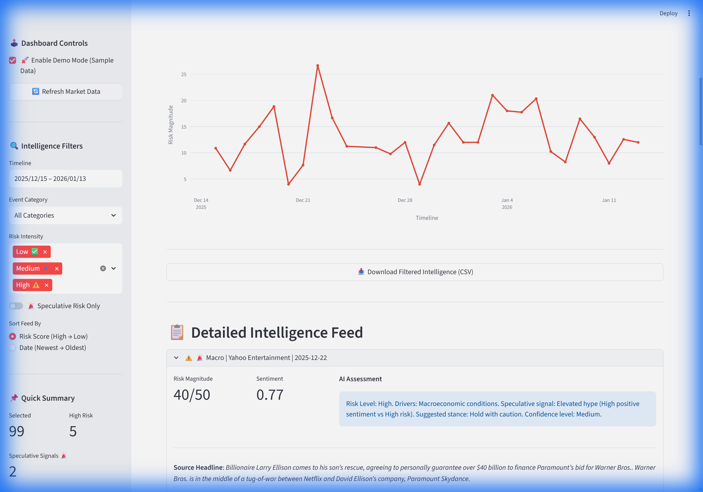

# 🎯 Market Risk Intelligence Platform

[](https://market-risk-intelligence.streamlit.app)
[](https://market-risk-intelligence.streamlit.app)
[](https://opensource.org/licenses/MIT)
[](https://www.python.org/downloads/)

An AI-driven risk assessment engine that transforms raw financial news signals into actionable market intelligence. Designed for traders, analysts, and risk managers to detect volatility before it hits the charts.



## 🚀 Interactive Demo
*Watch the intelligence engine in action: filtering live signals, analyzing risk, and generating assessments.*


---

## 🧠 Core Intelligence Methodology

The system uses a multi-stage pipeline to quantify market risk.

### 1. Risk Scoring Formula
Risk is quantified using a proprietary formula designed to balance magnitude and uncertainty:

**`Total Risk Score = (Severity + Uncertainty) * Scope`**

| Component | Description | Scale |
| :--- | :--- | :--- |
| **Severity** | The potential financial impact of the event type. | 1 (Low) - 5 (Critical) |
| **Uncertainty** | The ambiguity or lack of confirmation in the signal. | 1 (Confirmed) - 5 (Vague/Rumor) |
| **Scope** | The breadth of the market affected (Single stock vs. Global Macro). | 1 (Local) - 5 (Global) |

*The resulting score ranges from **2 to 50**, categorized into Low, Medium, and High Intensity.*

### 2. Speculative Hype Detection
The platform identifies "Speculative Risk" (potential bubbles) by crossing sentiment analysis with risk magnitude:
- **Condition**: Sentiment > 0.5 (Highly Positive/Hype) + Risk Score > 30 (Significant Magnitude).
- **Badge**: Marked with a 🚨 in the dashboard to alert users to overcrowded or hyped trades.

### 3. AI-Driven Explanation
**Human-in-the-loop AI**: AI (Large Language Models) is used **exclusively** for generating human-readable reasoning and "Suggested Stances." 
> [!IMPORTANT]
> The quantitative risk scores and event categories are determined by **deterministic rule-based engines** to ensure transparency and prevent "AI hallucinations" in financial calculations.

---

## 📊 Analytics & Insights



- **Risk Distribution**: Real-time breakdown of risk levels across Macro, Earnings, and Regulatory categories.
- **Historical Trends**: Visualizes the progression of market volatility over time.
- **Intelligence Feed**: Deep-dive cards with expanded reasoning logs for every signal.



---

## 🛠️ Installation & Setup

### 1. Clone the Repository
```bash
git clone https://github.com/your-username/MarketRiskIntelligence.git
cd MarketRiskIntelligence
```

### 2. Environment Setup
Create a virtual environment and install dependencies:
```bash
python -m venv venv
source venv/bin/activate  # On Windows: .\venv\Scripts\activate
pip install -r requirements.txt
```

### 3. Configure API Keys (Securely)
1. **Create .env**: Copy the template:
   ```bash
   cp .env.example .env
   ```
2. **Add NewsAPI Key**: Visit [NewsAPI.org](https://newsapi.org/) to get a free key and add it to your `.env` file:
   ```env
   NEWS_API_KEY=your_api_key_here
   ```

### 4. Run the Platform
```bash
streamlit run app.py
```

---

## 🏗️ Project Structure
- `app.py`: Main Streamlit dashboard and UI logic.
- `data_ingestion.py`: News fetching and signal aggregation.
- `risk_scoring.py`: Deterministic risk engine.
- `sentiment_analysis.py`: VADER sentiment and Hype detection.
- `explanation.py`: AI Intelligence summary generation.
- `sample_data/`: High-fidelity dataset for "Demo Mode" usage.

## 📄 Disclaimer
This project is for informational and educational purposes only. It does not constitute financial advice. AI-generated assessments should be verified against official financial filings.

---
*Created by Aviv Bandel - [Aviv Bandel](https://www.linkedin.com/in/aviv-bandel-617b742b7/)*
